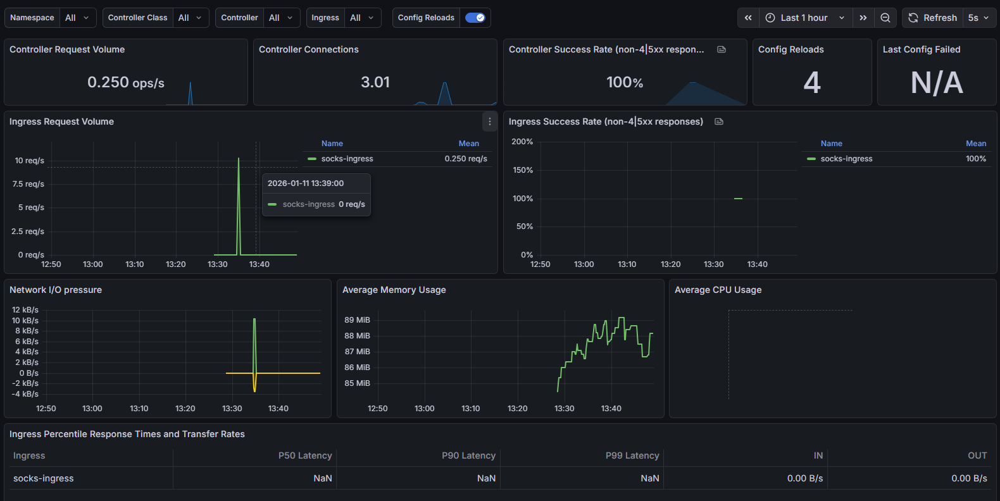
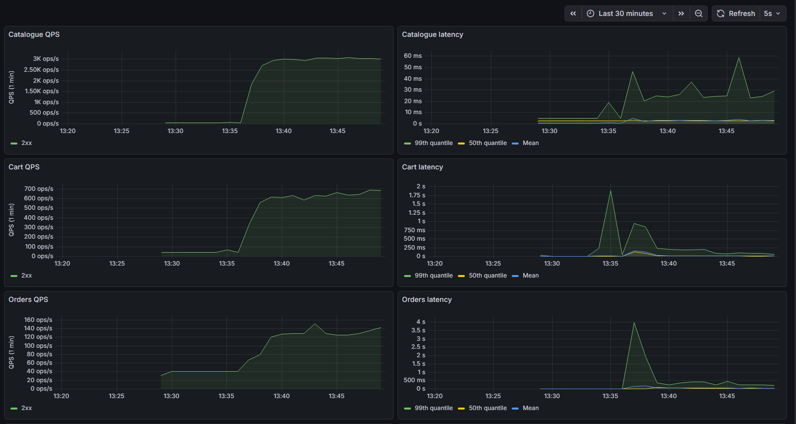
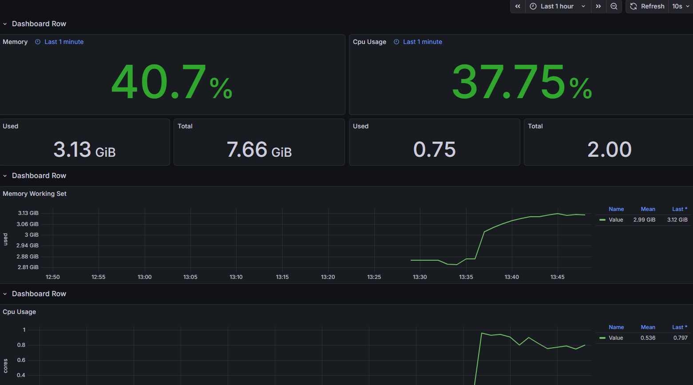

# EKS-Sockshop-DevOps

This repository contains automation and infrastructure code for deploying the **Sock Shop microservices demo (https://github.com/microservices-demo/microservices-demo)** on **AWS Elastic Kubernetes Service (EKS)** with development, staging, and CI/CD support.

The project includes:

- Environment-specific deployment artifacts (`sock-shop-dev`, `sock-shop-staging`)
- Terraform infrastructure to provision networking, EKS cluster, and related resources (`sock-shop-terraform`)

This setup demonstrates best practices for deploying a microservices application on AWS using Infrastructure as Code (IaC), Kubernetes manifests, and CI pipelines.

## Project Structure

- sock-shop-dev # Development environment deployments and configs
- sock-shop-staging # Staging environment deployments and configs
- sock-shop-terraform # Terraform IaC for provisioning AWS infrastructure.

  
## Prerequisites

Before using this repository, you should have:

- AWS account and AWS CLI configured  
- Terraform installed  
- kubectl installed and configured  
- Gitlab repository to use CI/CD pipelines


## 1. Provision infrastructure 
   ```
   cd sock-shop-terraform
   terraform init
   terraform apply
   ```
## 2. Deploy to dev environment
   
  the dev environment consists of three options:
- **docker compose**
  ```
  cd sock-shop-dev/docker-compose
  docker compose up -d
  ```
- **Kubernetes manifests:**
  ```
  cd sock-shop-dev/
  kubectl apply -f kubernetes/manifests/namespace.yaml
  kubectl apply -f kubernetes/manifests/
  ```
- **helm chart:**
  ```
  kubectl apply -f kubernetes/manifests/namespace.yaml
  helm install sockshop ./sock-shop-helm/ --values ./sock-shop-helm/values.yaml --namespace sock-shop --create-namespace
  ```
Health check and end-to-end tests are implemented in the CI pipeline and defined in [.gitlab-ci.yml](./sock-shop-dev/.gitlab-ci.yml).

## 3. Deploy to staging environment
   
  the staging environment consists of two options:
  
**Kubernetes manifests:**
  ```
  cd sock-shop-staging/
  kubectl apply -f kubernetes/manifests/namespace.yaml
  kubectl apply -f $RDS_SECRET_FILE  # i have used RDS as a replacement of the catalogue-db container, here we apply the credentials (dns endpoint)
  kubectl apply -f kubernetes/manifests/
  ```
**helm chart:**
  ```
  kubectl apply -f kubernetes/manifests/namespace.yaml
  kubectl apply -f $RDS_SECRET_FILE
  helm install sockshop ./sock-shop-helm/ --values ./sock-shop-helm/values.yaml --namespace sock-shop --create-namespace
  ```

setting the AWS CLI profile, the Health check and end-to-end tests are implemented in the CI pipeline and defined in [.gitlab-ci.yml](./sock-shop-staging/.gitlab-ci.yml).

## 4. Monitoring

   to set the moitoring environment do the following:
   
**Installing kube-prometheus-stack with Helm**
   ```
   helm repo add prometheus-community https://prometheus-community.github.io/helm-charts
   helm repo update
   helm install prometheus prometheus-community/kube-prometheus-stack --namespace monitoring --create-namespace --set grafana.service.type=NodePort --set promotheus.service.type=NodePort
   ```
**create the service monitor for all service which have prometheus end points**
   ```
   kubectl apply -f sock-shop-dev/kubernetes/monitoring/
   ```
   **create and apply a secret called grafana-secret.yaml contains the password of grafana service in the monitoring namespace**
   ```
   kubectl apply -f sock-shop-dev/kubernetes/monitoring/grafana-secret.yaml
   ```
**import the sock-shop dashboards by applying in order:**
   ```
   kubectl apply -f sock-shop-dev/kubernetes/monitoring/dashboards/20-grafana-configmap.yaml
   kubectl apply -f sock-shop-dev/kubernetes/monitoring/dashboards/23-grafana-import-dash-batch.yaml
   ```
**On the dev environment check on which port the grafana service is exposed by running:**
```
kubectl get svc -n monitoring
```
and then go to the localhost:GRAFANA_PORT to monitor the services.

**On the staging environment, the EKS nodes are private and are accessible only via bastion tunnel -bote that you need to pass the key name to connect to the bastion:
```
ssh -i sock-shop_keypair.pem -L 3301:$NODE_IN_CLUSTER:GRAFANA_PORT -L 9090:$NODE_IN_CLUSTER:PROMETHEUS_PORT ec2-user@BASTION_IP
```
**now grafana service will be exposed on port 3301 on local host and prometheus on 9090**
**note that the bastion public ip will be printed after applying the terraform deployment as an output**
## Screenshots:
**Nginx monitoring**

**Sock-shop performance dashboard**

**sock-shop resources dashboard**


